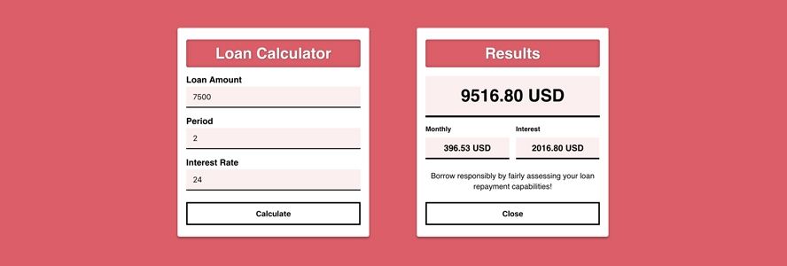

# Loan

## Description
Calculate your loan period and interest rate with our simple calculator.

### Rules
* Amount: __$500-25,000__
* Period: __1-5 years__
* Interest rate: __12-60%__

### Preview
🔗 https://projects.vasiljevs.com/loan/

## License
[MIT](LICENSE)